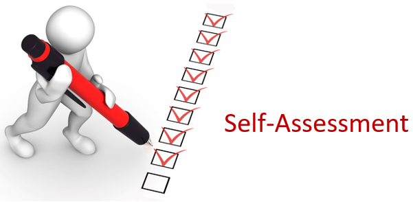
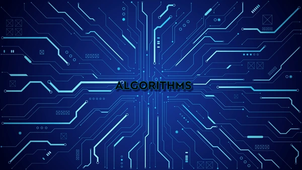

## Aaron Doss ePortfolio

This ePortfolio demonstrates the knowledge and skills I have gained and developed throughout my time studying towards a Computer Science degree at Southern New Hampshire University. It displays how I have grown and was able to make the Deans List each semeseter attended. 

&nbsp;[Professional Self-Assessment](#self-assessment "Professional Self-Assessment") 
&nbsp;&nbsp;&nbsp;&nbsp;&nbsp;[_Portfolio Considerations_](#portfolio-considerations "Portfolio Considerations") 
&nbsp;[Refinement Plan and Code Review](#codereview "Refinement Plan and Code Review") 
&nbsp;&nbsp;&nbsp;&nbsp;&nbsp;[_Code Review Video Link_](#code-reviews-video-link "Artifacts Code Review Videos Link") 
&nbsp;[Software Design and Engineering](#softwaredesign "Software Design and Engineering") 
&nbsp;&nbsp;&nbsp;&nbsp;&nbsp;[_Artifact Software Design and Engineering_](#artifact-software-design-and-engineering "Artifact Software Design and Engineering") 
&nbsp;[Algorithms and Data Structure](#algorithms "Algorithms and Data Structure") 
&nbsp;&nbsp;&nbsp;&nbsp;&nbsp;[_Artifact Algorithms and Data Structure_](#artifact-algorithms-and-data-structures "Artifact Algorithms and Data Structure") 
&nbsp;[Databases](#databases "Databases") 
&nbsp;&nbsp;&nbsp;&nbsp;&nbsp;[_Artifact Databases_](#artifact-databases "Artifact Databases") 

I began my pursuit of a Computer Science degree in 2023. I already had several classes which were able to transfer over which allowed me to start half way through the program. Throughout the two years I spent completing this degree I have learned an inumberable amount of skills and knowledge which I will utilize in my career to come. The first and foremost of which has been my knowledge of databases and how they operate. Before this program I had little to no knowledge of how to work with mongoDB or other popular database tools. Over the past year, especially, I have learned a great deal about them which will be demonstrated in two of my projects I'll present. I have also improved massively with paying attention to details and maintaining a security mindset while programming. This has allowed me to create more secure code than I previously was able to. One of the most important skills I have picked up has been testing and debugging skills. Testing is a crucial part towards ensuring a program is free of vulnerabilities and meets professional standards. This especially becomes important when working on a project which will continue to become more complicated as the project grows. Developing a tester mindset and understanding how to methodically develop a project are skills I wil continue to develop throughout my future computer science career. A few skills I have developed throughout the past two years can be seen below.

| **Hard Skills** | **Soft Skills** |
|:-----------:|:-----------:|
| Computer and Technology Skills | Organizational |
| Data Analysis | Attention to Detail |
| Data Visualization | Critical Thinking |
| Programming | Problem Solving |
| Software Development | Collaboration |
| Web Development | HTML/CSS/JS/Markdown |
| Technical Writing| JAVA |
| Security Mindset | Python |
| Mobile Development | C++ |

Throughout this program my ability to acquire new skills has increased dramaticcally. In order to stay on top of everything, I have had to learn how to adapt and learn skills quickly to be able to apply them to different purposes.

### _ePortfolio Considerations_

Every course I took throughout my semesters working towards this degree provided me with new knowledge and skills to add to my repertoire. That being said, there were three courses where the final projects were best suited towards displaying my overall growth in three important categories to my career path. These projects will be shown within this ePortfolio as well as a code review going over one of the projects.

Code reivews are a critical aspect of software developments. All developers have their own biases they may not recognize. Reviewing your own code and having others review your work often identifies critical bugs early in the development life cycle. A good code review is one where we view our code with a certain lense so that we do not get boggled down with a potentially overwhelming amount of code. The narrower the lense we review with, the better we can find bugs or possible enhancements to be made to our code. You can see my first [Code Review](https://youtu.be/hieSw2_2BF8) here.

As discussed in my code review, the artifact I selected to represent my software design and engineering skills is my **mobile application tracking app**. The app's goal is allow the user to track their weight using android mobile devices. The software was designed and developed for the purposes of a final project for the CS360 Mobile Architecture and Programming computer science course. The application was developed using Java with integration to a relational database using SQLite. The development for this project was completed using the development tool Android Studio IDE. Testing and running the app are completed through a device emulator inside Android Studio. This artifact involved an entire software design and engineering process. It intially began as a concept where we created diagrams of what each screen of the app would look like. Over time I was able to develop it into a full application. The enhancements I made to this application involved fixing existing bugs within the project and adding additional tracking abilities for user workouts. You can find the original project [here](https://github.com/aaronpdoss/SNHU-CS360) and the enhanced version [here](https://github.com/aaronpdoss/aaronpdoss.github.io/tree/main/enhancement/CS360-softwaredesign).

As discussed in my code review, the artifact I selected to represent my algorithms and data structures category is my **Text Based game**. This program initially acts a simple python script that allows the user to play a game where they navigate around a map created utilizing a python dictionary. I decided that a good enhancement to this project would be to take the python script and translate it into a C++ object oriented project utilizing C++ maps. This was my first time working with maps and took me a minute to figure out how to implement it to suit my needs. I chose this project and enhancement due to its work with different language data structures that can be utilized for the same purposes. You can find the original project [here](https://github.com/aaronpdoss/SNHU-IT140).

As discussed in my code review, the artifact I selected to represent my databases category was my Full-Stack **Travel Website**. This project was created for my CS-499 Full-Stack Development course final project. The website acts as a travel website advertising different travel package experiences. This project utilizes the MEAN stack framework. I chose this project to represent my work in this category as it was my first experience working with linking a website with a MongoDB to host information for the site. This was my favorite artifact to work with as I learned the most from it. I utilized postman for testing purposes to ensure my GET and POST methods for updating and retrieving information from the MongoDB worked correctly. You can see this project and its different versions [here](https://github.com/aaronpdoss/cs465-fullstack)
